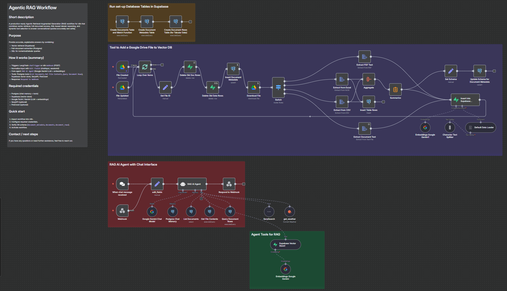

# Agentic RAG Workflow for Agricultural Advisory



This n8n workflow implements a production-ready, agentic Retrieval-Augmented Generation (RAG) system designed to function as an intelligent agricultural advisor. It combines multi-source information retrieval—including a vector database, a relational database with SQL access, and live web search—with a powerful Large Language Model (LLM) to provide accurate, context-aware, and well-sourced answers to conversational queries.

### ✨ Core Features
- **🤖 Agentic Framework:** A Google Gemini-powered agent that autonomously selects tools to answer queries.
- **📚 Multi-Source RAG:** Retrieves data from a Supabase vector store, a Postgres SQL database, and live web search (SerpAPI).
- **🌦️ Context-Aware:** Integrates live OpenWeatherMap data for location-specific advice.
- **⚙️ Automated Data Ingestion:** Automatically processes and indexes files (PDF, XLSX, CSV) uploaded to a Google Drive folder.
- **💬 Dual Triggers:** Includes a simple Chat Interface for testing and a Webhook for production integration.

---

## 🚀 Quickstart Guide

### 1. Import Workflow & Add Credentials
- Import the `.json` workflow into your n8n canvas.
- In your n8n instance, go to **Credentials** and add credentials for the following services:
  - `Postgres` ( i have used the supabase postgres services )
  - `Supabase` 
  - `Google Gemini`
  - `Google Drive` ( OAuth2 )
  - `OpenWeatherMap`
  - `SerpAPI`

### 2. Initialize the Database
This is a **one-time setup**. On the canvas, find the three disconnected Postgres nodes for database setup and run each one manually using the "play" icon on the node.
1.  `Create Documents Table and Match Function`
2.  `Create Document Metadata Table`
3.  `Create Document Rows Table (for Tabular Data)`

### 3. Add Data to Your Knowledge Base
- Configure the **Google Drive Trigger** nodes (`File Created`, `File Updated`) to point to a folder in your Google Drive.
- Add a PDF, CSV, or XLSX file to that folder. The workflow will automatically process it, add it to your Postgres DB, and create vector embeddings in Supabase.

### 4. Test the Agent
1.  **Activate Workflow:** Click the **"Active"** toggle on the top right of the canvas.
2.  **Use the Chat UI:** The simplest way to test. Open the `When chat message received` node and click **"Open Chat"**.
3.  **Use the Webhook:** Send a `POST` request to the Test Webhook URL found in the `Webhook` node.

## Webhook Setup Tutorial
For integration into other applications, use the webhook trigger.

1. Get the Webhook URL:
- Make sure your workflow is active.
- Go to the Webhook node on the canvas.
- Under "Webhook URLs", copy the Test URL. For production, you will use the Production URL.

2. Send a POST Request:
- Use any API client (like Postman, Insomnia, or a simple curl command) to send a POST request to the copied URL.
- The request body must be JSON and contain a query and a unique sessionId. You can also include a city.

3. Check the Response
- The webhook will return a response containing the agent's JSON output. The agent is configured to produce a JSON object like this:
```bash
{
  "output": "Based on the knowledge base, the best practices for drought irrigation include using drip systems to minimize evaporation and watering early in the morning. A recent web search also indicates that local authorities in Fresno are advising farmers to monitor soil moisture levels closely. The current weather in Fresno is clear and sunny."
}
```